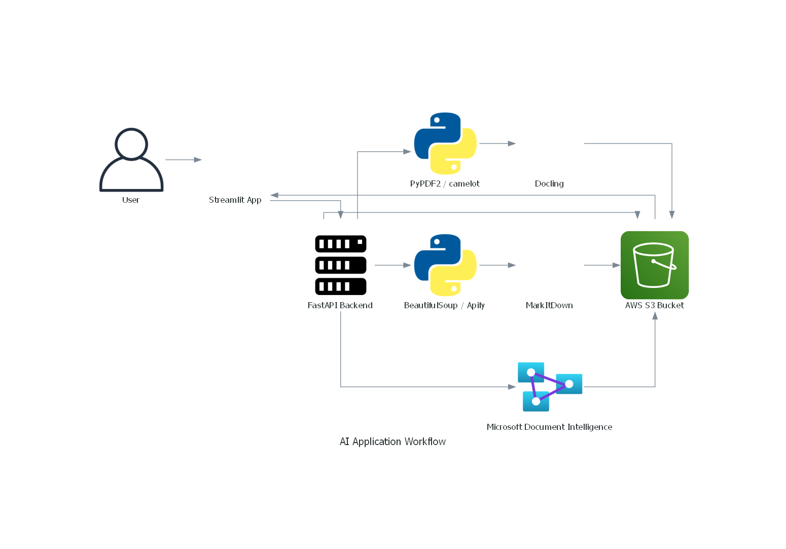

Certainly! Below is the updated `README.md` file with the workflow diagram image (`ai_application_workflow.png`) included. I've added a section to display the diagram and updated the **Workflow Diagram** section.

---

# AI Application Workflow

This project outlines the architecture and workflow of an AI application that processes and standardizes data from various sources (PDFs, web scraping, and enterprise services) and stores it in an AWS S3 bucket. The application is built using a combination of Python libraries, FastAPI for the backend, and Streamlit for the frontend.

## Workflow Diagram

Below is the workflow diagram for the AI Application:



### Diagram Description:
1. **User**: The end-user interacts with the application via the Streamlit frontend.
2. **Streamlit App**: The frontend built using Streamlit.
3. **FastAPI Backend**: The backend server that handles data processing.
4. **Data Extraction**:
   - **PyPDF2 / pdfplumber**: For extracting data from PDF files.
   - **BeautifulSoup / Scrapy**: For web scraping.
   - **Microsoft Document Intelligence**: For enterprise-level document processing.
5. **Standardization Tools**:
   - **Docling**: A custom tool for standardizing extracted data.
   - **MarkItDown**: Another custom tool for further data standardization.
6. **AWS S3 Bucket**: Used for storing processed data.

---

## Components

1. **User**: The end-user interacts with the application via the Streamlit frontend.
2. **Streamlit Frontend**: A custom frontend built using Streamlit for user interaction.
3. **FastAPI Backend**: A backend server built using FastAPI to handle data processing and communication with other services.
4. **Data Extraction**:
   - **PyPDF2 / pdfplumber**: For extracting data from PDF files.
   - **BeautifulSoup / Scrapy**: For web scraping.
   - **Microsoft Document Intelligence**: For enterprise-level document processing.
5. **Standardization Tools**:
   - **Docling**: A custom tool for standardizing extracted data.
   - **MarkItDown**: Another custom tool for further data standardization.
6. **AWS S3 Bucket**: Used for storing processed data.

---

## Workflow Steps

1. The **User** uploads data via the **Streamlit Frontend**.
2. The **Frontend** sends the data to the **FastAPI Backend**.
3. The **Backend** processes the data using one or more of the following:
   - **PyPDF2 / pdfplumber** for PDF extraction.
   - **BeautifulSoup / Scrapy** for web scraping.
   - **Microsoft Document Intelligence** for enterprise document processing.
4. The extracted data is standardized using **Docling** and **MarkItDown**.
5. The processed data is stored in an **AWS S3 Bucket**.
6. The **Frontend** retrieves the processed data from the **S3 Bucket** and displays it to the **User**.

---

## Prerequisites

- Python 3.7+
- [Diagrams](https://diagrams.mingrammer.com/) library for generating the workflow diagram.
- AWS account with S3 bucket access.
- Streamlit and FastAPI installed for frontend and backend development.

---

## Installation

1. Clone the repository:
   ```bash
   git clone https://github.com/yourusername/ai-application-workflow.git
   cd ai-application-workflow
   ```

2. Install the required Python packages:
   ```bash
   pip install -r requirements.txt
   ```

3. Ensure you have the custom icons (`microsoft.png`, `docling.png`, `markitdown.png`, `streamlit.png`) in the `./icons/` directory.

4. Generate the workflow diagram:
   ```bash
   python generate_diagram.py
   ```

---

## Usage

1. Run the FastAPI backend:
   ```bash
   uvicorn backend:app --reload
   ```

2. Run the Streamlit frontend:
   ```bash
   streamlit run frontend.py
   ```

3. Open your browser and navigate to `http://localhost:8501` to interact with the application.

---

## Custom Icons

Place your custom icons in the `./icons/` directory. The following icons are required:
- `microsoft.png`
- `docling.png`
- `markitdown.png`
- `streamlit.png`

---

## Contributing

Contributions are welcome! Please open an issue or submit a pull request for any improvements or bug fixes.

---

## License

This project is licensed under the MIT License. See the [LICENSE](LICENSE) file for details.

---

### Notes:
- Replace `yourusername` in the repository URL with your actual GitHub username.
- Ensure the `generate_diagram.py` script is created to generate the workflow diagram.
- Update the `LICENSE` file if you choose a different license.

Let me know if you need further assistance!
